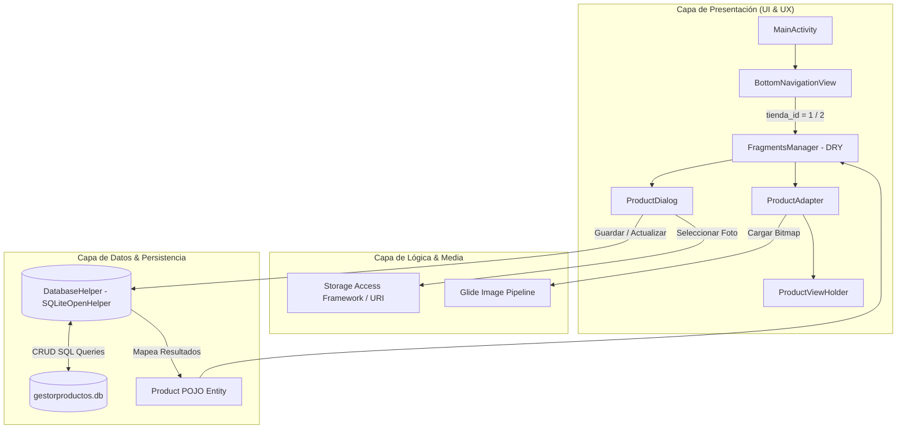

<div align="center">

# 🏷️ X-Fit & SportHouse — Retail POS & Mobile Price Checker

**Herramienta móvil nativa offline-first para la verificación ágil de precios, consulta de referencias y control de inventario de prendas deportivas en punto de venta (tienda física).**

*Diseñada para suprimir la lentitud operativa en mostrador, empoderando al asesor comercial para brindar atención al cliente inmediata sin depender de terminales fijas ni conexión a internet.*

---

[](https://developer.android.com/)
[](https://www.oracle.com/java/)
[](https://www.sqlite.org/)
[](https://m3.material.io/)
[](https://github.com/bumptech/glide)
[](https://gradle.org/)
[](https://developer.android.com/topic/architecture)
[](./LICENSE)

</div>

---

## 📌 Tabla de Contenidos

- [Contexto Operativo: El Problema en Tienda](#-contexto-operativo-el-problema-en-tienda)
- [La Solución: Asistente Móvil en Punto de Venta](#-la-solución-asistente-móvil-en-punto-de-venta)
- [Capacidades Clave del Sistema](#-capacidades-clave-del-sistema)
- [Arquitectura de Software y Capas](#-arquitectura-de-software-y-capas)
- [Stack Tecnológico y Dependencias](#-stack-tecnológico-y-dependencias)
- [Esquema de Base de Datos (SQLite)](#-esquema-de-base-de-datos-sqlite)
- [Identidad Visual y Diseño Ergonómico](#-identidad-visual-y-diseño-ergonómico)
- [Demostración Visual / Capturas](#-demostración-visual--capturas)
- [Requisitos Previos](#-requisitos-previos)
- [Instalación y Ejecución Local](#-instalación-y-ejecución-local)
- [Generación y Distribución del APK](#-generación-y-distribución-del-apk)
- [Hoja de Ruta (Roadmap Comercial)](#-hoja-de-ruta-roadmap-comercial)
- [Autor y Licencia](#-autor-y-licencia)

---

## 🏪 Contexto Operativo: El Problema en Tienda

En el sector de retail de prendas y calzado deportivo en tiendas físicas (*XFit* y *SportHouse*), la atención ágil en el piso de venta es crítica para cerrar conversiones y evitar que el cliente abandone el local por demoras en la atención:

```
[Cliente solicita precio] ➔ [Asesor busca en chats / camina a la PC] ➔ [Demora de 1 a 3 min] ➔ [Fricción en la venta]
```

### Principales Fricciones Operativas Identificadas:
1. **Pérdida de Tiempo en Consulta de Precios:** Los asesores comerciales dependían de chats de mensajería (WhatsApp/Telegram) donde las listas de precios estaban dispersas, desactualizadas o enterradas entre cientos de mensajes.
2. **Dependencia de Terminales Fijas (Cuellos de Botella):** Para verificar el precio de una prenda, el asesor debía abandonar al cliente en el pasillo y caminar hacia el mostrador principal para consultar el computador de caja, provocando filas y tiempos muertos.
3. **Zonas Ciegas de Conectividad:** La infraestructura física de los locales comerciales suele presentar mala cobertura celular o caídas esporádicas de Wi-Fi, imposibilitando el uso fluido de hojas de cálculo compartidas o herramientas SaaS en la nube.
4. **Múltiples Marcas/Tiendas:** Dificultad para conmutar rápidamente entre los inventarios independientes de **XFit** y **SportHouse** desde una misma herramienta.

---

## 💡 La Solución: Asistente Móvil en Punto de Venta

**X-Fit & SportHouse - Price Checker & Retail Catalog** transforma el teléfono inteligente del vendedor en una terminal de verificación portátil, permitiendo:

```
[Cliente solicita precio] ➔ [Asesor abre app móvil offline] ➔ [Respuesta en < 1 segundo] ➔ [Venta fluida y asesoría profesional]
```

- **Respuesta Inmediata (<1s):** Localización visual instantánea de la prenda por fotografía, nombre y precio formateado.
- **Funcionamiento 100% Offline:** Persistencia local embebida con SQLite. La aplicación jamás se detiene por falta de internet.
- **Gestión Descentralizada:** El asesor puede registrar nuevas referencias, actualizar precios promocionales o depurar artículos agotados en tiempo real desde el mismo pasillo de exhibición.
- **Arquitectura DRY Multi-Tienda:** Gestión separada pero centralizada para XFit y SportHouse con una experiencia de usuario estandarizada.

---

## ✨ Capacidades Clave del Sistema

### ⚡ Verificación Ultrarrápida de Precios
- Consulta ágil del catálogo con tipografía de alto contraste (`$ 00,000`).
- Renderizado de tarjetas de producto enriquecidas con fotografía real del artículo para evitar confusiones de modelo o colorway.

### 🏷️ Gestión Multi-Marca y Multi-Tienda
- Navegación instantánea mediante barra inferior (*BottomNavigationView*) entre:
  - **Tienda 1 — XFit:** Catálogo especializado de prendas fitness y cross-training.
  - **Tienda 2 — SportHouse:** Catálogo de indumentaria deportiva casual y calzado.
- Filtrado automático a nivel de base de datos (`tienda_id`) con etiquetas (*badges*) distintivas de color para cada establecimiento.

### 📦 Operaciones CRUD en Tiempo Real
- **Registro Rápido:** Formulario modal en `ProductDialog` con validaciones de campos obligatorios (nombre comercial y precio numérico).
- **Actualización In Situ:** Modificación directa de precios frente a cambios de tarifas, descuentos de temporada o corrección de nombres.
- **Eliminación Segura:** Diálogo de confirmación interactivo (`AlertDialog`) para mitigar eliminaciones por pulsaciones involuntarias.

### 🖼️ Identificación Visual con Persistencia de Permisos
- Integración con el **Storage Access Framework (SAF)** mediante `ActivityResultContracts.GetContent()`.
- Implementación de `takePersistableUriPermission` con bandera `FLAG_GRANT_READ_URI_PERMISSION`, permitiendo que el acceso a las imágenes de la galería persista aun tras reiniciar el dispositivo móvil.
- Pipeline de decodificación eficiente y caché con **Bumptech Glide**, previniendo problemas de *OutOfMemory (OOM)* en dispositivos de gama de entrada.

### 🛡️ Diseño Ergonómico para Jornadas Comerciales
- Construido con **Google Material Components 3**.
- Forzado de modo claro (`AppCompatDelegate.MODE_NIGHT_NO`) para asegurar legibilidad uniforme bajo la iluminación artificial intensa de centros comerciales y locales retail.

---

## 🏛️ Arquitectura de Software y Capas

El proyecto adopta el patrón **Single-Activity Architecture** respaldado por Android Jetpack y el principio **DRY (Don't Repeat Yourself)**:



### Matriz de Capas de la Solución

| Capa Arquitectónica | Componente / Archivo | Tecnología | Rol Funcional en Retail |
| :--- | :--- | :--- | :--- |
| **Presentación (Host)** | [`MainActivity.java`](file:///C:/Users/MIGUEL%20ANGEL/AndroidStudioProjects/GestorProductos/app/src/main/java/com/example/gestorproductos/MainActivity.java) | `AppCompatActivity`, `BottomNav` | Contenedor principal de la app y despachador de navegación entre tiendas. |
| **Presentación (Catálogo)** | [`FragmentsManager.java`](file:///C:/Users/MIGUEL%20ANGEL/AndroidStudioProjects/GestorProductos/app/src/main/java/com/example/gestorproductos/FragmentsManager.java) | `Fragment`, `ViewBinding` | Controlador unificado que gestiona el ciclo de vida del catálogo según la tienda activa. |
| **Presentación (Listado)** | [`ProductAdapter.java`](file:///C:/Users/MIGUEL%20ANGEL/AndroidStudioProjects/GestorProductos/app/src/main/java/com/example/gestorproductos/ProductAdapter.java) | `RecyclerView.Adapter` | Reciclaje de memoria en lista de productos e interactores de clic para editar/eliminar. |
| **Formularios & Modales** | [`ProductDialog.java`](file:///C:/Users/MIGUEL%20ANGEL/AndroidStudioProjects/GestorProductos/app/src/main/java/com/example/gestorproductos/ProductDialog.java) | `AlertDialog`, `LayoutInflater` | Formulario dinámico de alta y edición con previsualización reactiva de imagen. |
| **Procesamiento Gráfico** | Glide 4.16.0 | `Glide.with()` | Carga asíncrona, compresión, escalado `centerCrop` y manejo de placeholders. |
| **Persistencia de Datos** | [`DatabaseHelper.java`](file:///C:/Users/MIGUEL%20ANGEL/AndroidStudioProjects/GestorProductos/app/src/main/java/com/example/gestorproductos/DatabaseHelper.java) | `SQLiteOpenHelper` | Abstracción de base de datos relacional para operaciones de inserción, consulta, actualización y borrado. |
| **Modelo de Negocio** | [`Product.java`](file:///C:/Users/MIGUEL%20ANGEL/AndroidStudioProjects/GestorProductos/app/src/main/java/com/example/gestorproductos/Product.java) | POJO / Java Bean | Representación del artículo de ropa deportiva (id, nombre, precio, imagen, tienda). |

---

## 🗄️ Esquema de Base de Datos (SQLite)

La persistencia se ejecuta en el archivo local `gestorproductos.db` administrado por `DatabaseHelper`:

### Tabla: `product`

```sql
CREATE TABLE product (
    id        INTEGER PRIMARY KEY AUTOINCREMENT,
    p_nombre  TEXT,
    p_precio  REAL,
    p_imagen  TEXT,
    tienda_id INTEGER
);
```

| Campo | Tipo | Restricción | Uso Operativo |
| :--- | :--- | :--- | :--- |
| `id` | `INTEGER` | `PRIMARY KEY AUTOINCREMENT` | Código numérico interno de la prenda. |
| `p_nombre` | `TEXT` | `NOT NULL` | Nombre descriptivo (ej. *"Camiseta Compresión Pro Negra M"*). |
| `p_precio` | `REAL` | `NOT NULL` | Precio de venta al público en moneda local. |
| `p_imagen` | `TEXT` | `NULLABLE` | Cadena URI del recurso en almacenamiento para renderizado visual. |
| `tienda_id` | `INTEGER` | `NOT NULL` | Filtro de marca: `1` = **XFit**, `2` = **SportHouse**. |

---

## 🎨 Identidad Visual y Diseño Ergonómico

La paleta cromática se seleccionó rigurosamente para garantizar contraste y visibilidad bajo reflectores comerciales:

| Identificador | Muestra | Código HEX | Utilidad en el Piso de Venta |
| :--- | :---: | :--- | :--- |
| **Primary Navy** |  | `#1B3A5C` | Barras de navegación superior, cabecera de diálogos y acciones de edición. |
| **Accent Orange** |  | `#F4801A` | Botón Flotante (FAB) de adición rápida y confirmación de guardado. |
| **Success Green** |  | `#4CAF82` | Destacado tipográfico del precio comercial. |
| **Surface White** |  | `#FFFFFF` | Contenedores tipo Card para los artículos. |
| **Background Light** |  | `#F5F7FA` | Fondo ergonómico para reducir fatiga ocular en turnos extendidos. |

---

## 📱 Demostración Visual / Capturas

<div align="center">
  <table>
    <tr>
      <td align="center" width="33%"><b>1. Catálogo XFit (Fitness)</b></td>
      <td align="center" width="33%"><b>2. Catálogo SportHouse (Casual)</b></td>
      <td align="center" width="33%"><b>3. Modal Registro & Edición</b></td>
    </tr>
    <tr>
      <td align="center">
        
        <br />
        <sub><i>Listado ágil con selector de tienda activo en XFit</i></sub>
      </td>
      <td align="center">
        
        <br />
        <sub><i>Conmutación instantánea a inventario de SportHouse</i></sub>
      </td>
      <td align="center">
        
        <br />
        <sub><i>Edición in situ de nombre, precio e imagen de galería</i></sub>
      </td>
    </tr>
  </table>
</div>

---

## 📋 Requisitos Previos

- **Java Development Kit (JDK):** Versión 11 LTS (o superior: 17 / 21).
- **Android Studio:** Hedgehog (2023.1.1) o superior.
- **Android SDK:**
  - `minSdkVersion`: **24** (Android 7.0 Nougat).
  - `targetSdkVersion`: **36** (Android 16).
  - `compileSdkVersion`: **36**.
- **Dispositivo de Prueba:** Smartphone físico con Android 7.0+ o Emulador con Android Virtual Device (AVD).

---

## 🚀 Instalación y Ejecución Local

### 1. Clonar el Repositorio

```bash
git clone https://github.com/MiguelMD06/Gestor-Productos.git
cd Gestor-Productos
```

### 2. Configuración de Entorno Local

El repositorio incluye la plantilla [`local.properties.example`](./local.properties.example). Crea tu archivo de configuración local:

**Windows (PowerShell):**
```powershell
Copy-Item local.properties.example local.properties
```

**Linux / macOS:**
```bash
cp local.properties.example local.properties
```

Especifica la ruta a tu SDK de Android en `local.properties`:
```properties
# Ejemplo en Windows:
sdk.dir=C\:\\Users\\<TuUsuario>\\AppData\\Local\\Android\\Sdk

# Ejemplo en macOS:
sdk.dir=/Users/<TuUsuario>/Library/Android/sdk

# Ejemplo en Linux:
sdk.dir=/home/<TuUsuario>/Android/Sdk
```

### 3. Compilación por Línea de Comandos (CLI)

Utiliza el Gradle Wrapper incluido en la raíz:

```bash
# Compilar fuentes Java y validar recursos
.\gradlew.bat compileDebugJavaWithJavac   # Windows
./gradlew compileDebugJavaWithJavac       # Linux/macOS
```

---

## 📦 Generación y Distribución del APK

Para instalar y utilizar la aplicación directamente en los teléfonos inteligentes del equipo de ventas sin necesidad de tener abierta la computadora de desarrollo:

### 1. Generar el Paquete APK (Debug)
Ejecuta el siguiente comando en la raíz del proyecto:

```bash
# En Windows:
.\gradlew.bat assembleDebug

# En Linux / macOS:
./gradlew assembleDebug
```

El binario ejecutable compilado quedará generado en la siguiente ruta:
```text
app/build/outputs/apk/debug/app-debug.apk
```

### 2. Métodos de Instalación en Smartphone Físico:

#### Opción A: Vía Cable USB con ADB (Recomendado para desarrolladores)
Conecta el teléfono con **Depuración USB** activada y ejecuta:
```bash
adb install -r app/build/outputs/apk/debug/app-debug.apk
```

#### Opción B: Distribución Directa (Para asesores en tienda)
1. Envía el archivo `app-debug.apk` al dispositivo móvil a través de WhatsApp Web, Telegram, Google Drive o cable USB.
2. En el teléfono, abre el archivo descargado.
3. Si el sistema lo solicita, autoriza la casilla **"Permitir la instalación de aplicaciones desconocidas"**.
4. Presiona **Instalar** y ¡listo! La herramienta queda disponible en el menú de aplicaciones.

---

## 🗺️ Hoja de Ruta (Roadmap Comercial)

- [ ] **Escáner de Código de Barras / EAN-13:** Integración con Google ML Kit para consultar referencias apuntando con la cámara trasera.
- [ ] **Búsqueda Predictiva en Tiempo Real:** Barra `SearchView` superior para filtrar prendas por talla, color o nombre sin desplazarse por la lista.
- [ ] **Exportación de Catálogo a PDF:** Generación de fichas de precios en PDF para compartir al instante con clientes vía WhatsApp.
- [ ] **Sincronización P2P o Respaldo en la Nube:** Opción de exportar/importar la base de datos `gestorproductos.db` entre dispositivos del mismo local comercial.

---

## 👤 Autor y Licencia

Desarrollado por **Miguel Medina Díaz** ([@MiguelMD06](https://github.com/MiguelMD06)) como solución de software aplicada a la optimización de procesos en el retail deportivo.

Este proyecto es de código abierto y se distribuye bajo la licencia **MIT**. Consulta el archivo [LICENSE](./LICENSE) para conocer los términos legales y condiciones de uso.
